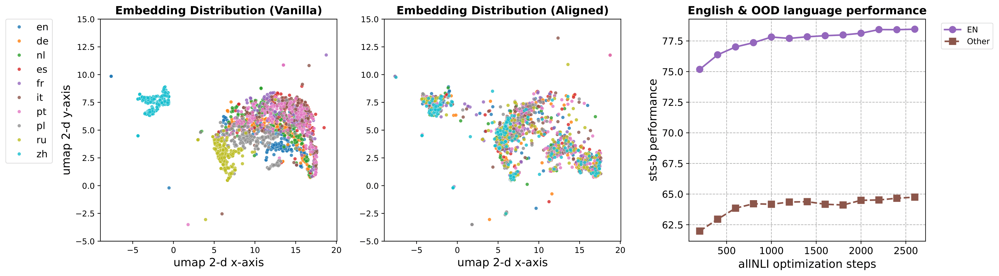

# Pixel Linguist

> Offical Repo of paper _Pixel Sentence Representation Learning_

- **Model Checkpoint:** [at HuggingFace](https://huggingface.co/Pixel-Linguist/Pixel-Linguist-v0)
- **Github Repo:** [Github Repo](https://github.com/gowitheflow-1998/Pixel-Linguist)
- **Paper:** https://arxiv.org/pdf/2402.08183.pdf

## Overview
<p align="center">
  
</p>

## Installation

```
conda create -n pixel python=3.9 -y && conda activate pixel
git clone https://github.com/gowitheflow-1998/Pixel-Linguist.git
```

### package install
```
conda install pytorch==1.11.0 torchvision==0.12.0 torchaudio==0.11.0 cudatoolkit=11.3 -c pytorch
conda install -c conda-forge pycairo pygobject manimpango scikit-learn
cd Pixel-Linguist
pip install -r requirements.txt
pip install -e .
```

## Fallback fonts downloading

(Do not need to download this if directly git clone our repo)
```
python scripts/data/download_fallback_fonts.py ‘data/fallback_fonts’
```

## Inference and Evaluation

sts benchmark:
```
python tools/evaluation_sts.py
```
Adjust the specific language you want to evaluate.

beir:
```
python tools/evaluation_retrieval.py
```
It is convenient to evaluate on other datasets available on BEIR, other than Natural Questions that we evaluated in the paper. Simply modify dataset name in the script.

## Reproduce Pixel Linguist Training

<p align="center">
  
</p>

Step 0: Visual alignment step:
```
bash run_bash/0-run_unsup.sh
```
For this step, run separately on all our unsup datasets to create 4 checkpoints, and do an ensemble using ```tools/ensemble.py```.

Step 1: Topical alignment step:
```
bash run_bash/1-run_wikispan.sh
```
Step 2: Reasoning alignment step:
```
bash run_bash/2-run_allnli_finetune.sh
```
Step 3: multilingual transfer step:
```
bash run_bash/3-run_allnli-pm.sh
```
Go back and forth between Step 2 and Step 3 (see paper for exact procedure of the iterative training where "leapfrogging" pattern is found!) for 2-3 times for maximum performance, please end the training with English allnli, instead of parallel data.

<p align="center">
  
</p>

## Note

We find that training with an extra MLP (using ```PIXELForSequenceClassification``` class) but do inference without (using ```PIXELForRepresentation```, which then drops the MLP), boosts the semantics performance a little bit, providing the performance in the latest version of the paper.
